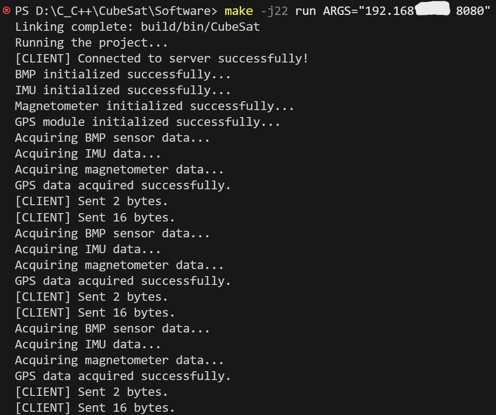
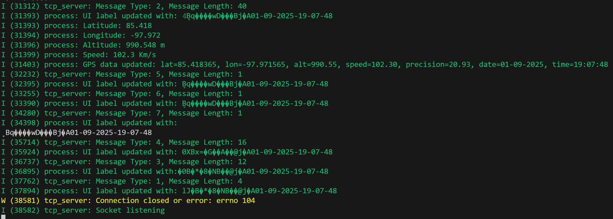
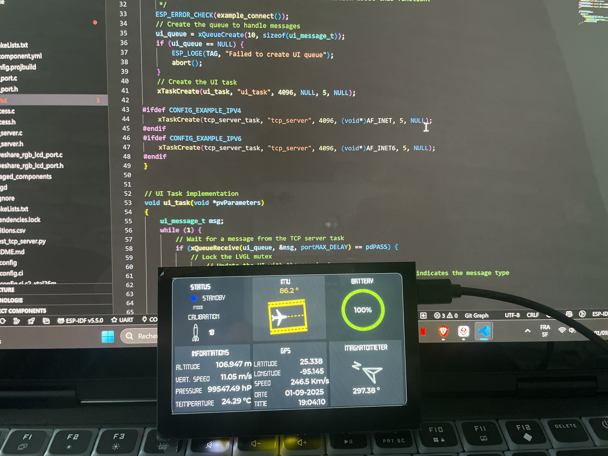

#  CubeSat Simulation Project

Ce projet simule un **CubeSat** (mini-satellite) qui génère et transmet des données vers un **ESP32** équipé d’un écran **LCD**.  
La communication entre le simulateur et l’ESP32 se fait via le **protocole TCP**, permettant un échange de données en temps réel.

##  Fonctionnalités

-  Simulation de génération et transmission de données d’un CubeSat  
-  Réception et affichage des données sur un ESP32  
-  Visualisation en temps réel sur écran LCD  
-  Communication via TCP 

##  Composants

1. **CubeSat** – Application en C++ (simulation et envoi des données)  
2. **ESP32 Receiver** – Firmware basé sur  ESP-IDF (réception et affichage)  
3. **LCD Display** – Interface pour afficher les données en direct  

##  Installation & Configuration

### Prérequis

- Un environnement de développement C++ (g++ ou équivalent)  
- **ESP-IDF** configuré pour l’ESP32  
- Une connexion réseau (Wi-Fi ou Ethernet) pour la communication TCP  

### Étapes d’installation

1. Cloner le dépôt :  

```bash
   git clone https://github.com/Aliou8/CubeSat.git
````

2. Compiler et lancer le **simulateur CubeSat** sur votre machine.
3. Flasher l’ESP32 avec le firmware fourni dans le dossier `/esp32`.
4. Connecter l’ESP32 au même réseau que l’ordinateur.

##  Utilisation

1. Lancer le simulateur CubeSat :

   ```bash
   ./build/bin/CubeSat
   ```
2. Vérifier que l’ESP32 est bien connecté au réseau.
3. Les données générées par le simulateur apparaîtront automatiquement sur l’écran LCD connecté à l’ESP32.
4. Assurez-vous d’avoir correctement défini les paramètres de connexion Wi-Fi dans le code de l’ESP32.

###Résultats
Communication Client-Serveur
<p align="center">
  
  
</p>
Interface graphique sur ESP32
<p align="center">
  
</p>
[▶️ Voir la vidéo](https://github.com/Aliou8/CubeSat/raw/main/RSC/video.mp4)


